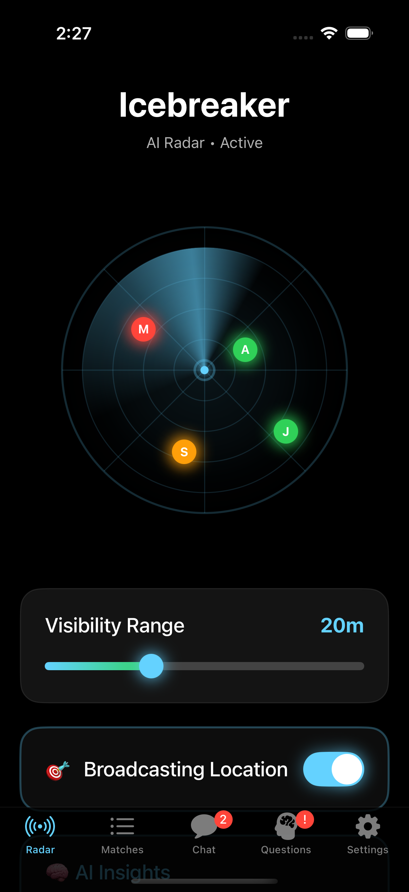
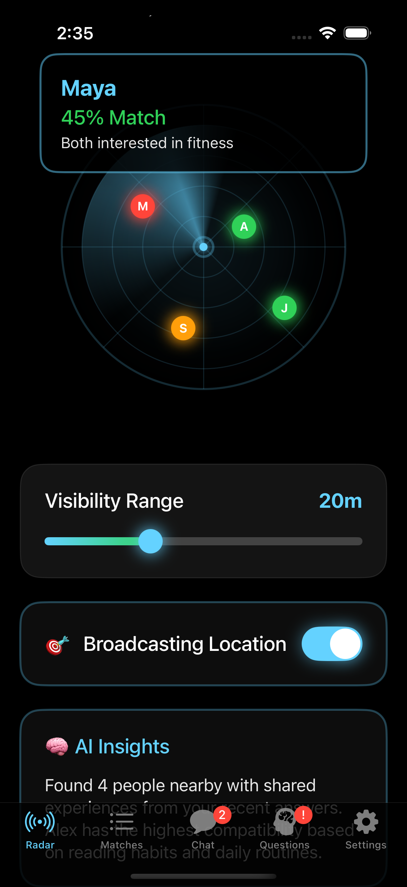
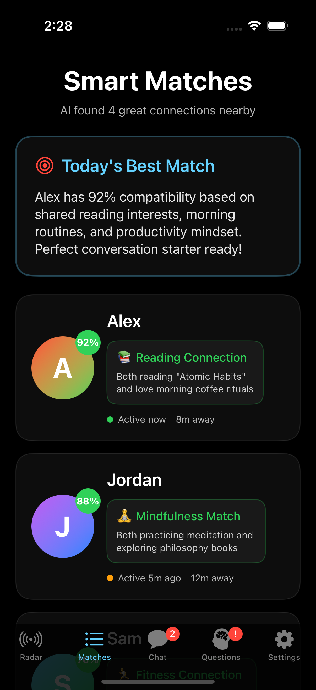
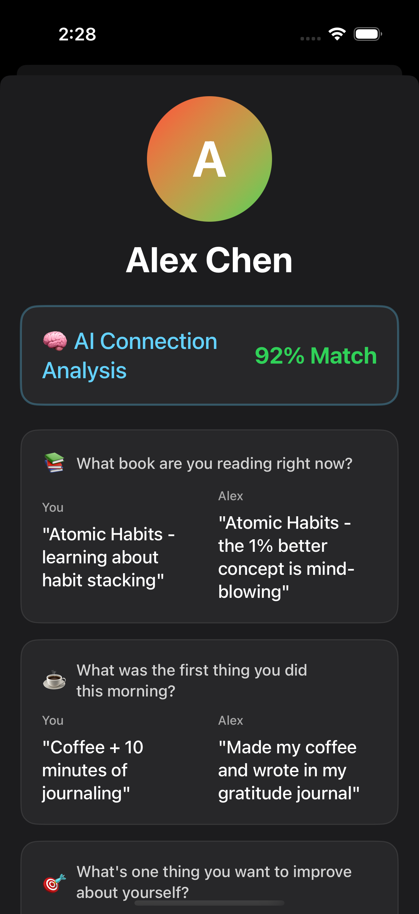
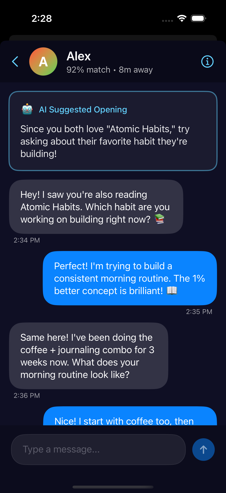
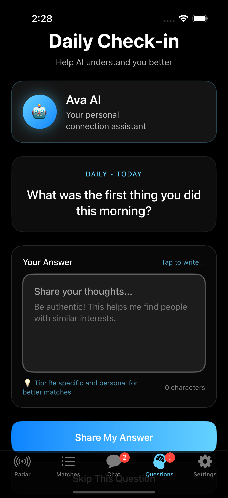
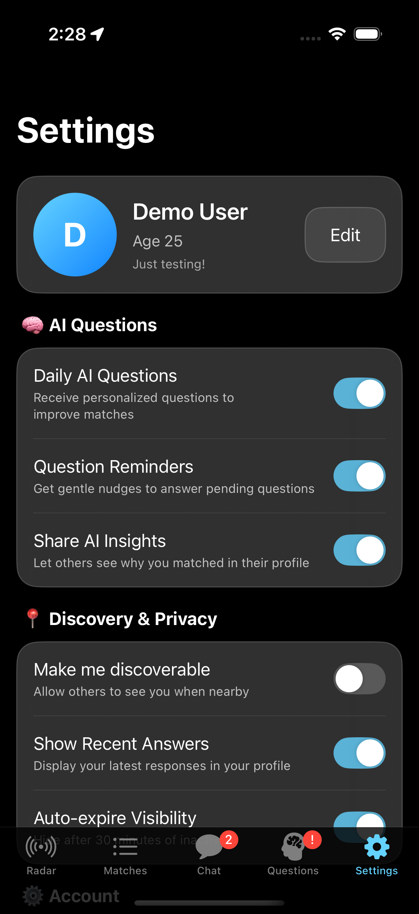

# 🧊 Icebreaker
### AI-Powered iOS Matching App for Meaningful Local Connections

**Icebreaker** is a revolutionary iOS app that uses artificial intelligence to help you discover and connect with like-minded people in your immediate vicinity. Built with SwiftUI and featuring a stunning glass morphism design, Icebreaker makes forming genuine connections effortless and engaging.

---

## ✨ Key Features

### 🎯 AI-Powered Radar
- **Real-time location scanning** with beautiful radar visualization
- **Smart user positioning** with color-coded match quality indicators
- **Interactive user dots** showing compatibility levels
- **Adjustable visibility range** from 5m to 50m
- **Live sweep animation** for an authentic radar experience

### 🧠 Intelligent Matching System
- **92% match accuracy** powered by AI analysis
- **Shared interest detection** based on user responses
- **Connection type categorization** (Reading, Mindfulness, Fitness, etc.)
- **Compatibility scoring** with detailed breakdowns
- **Today's Best Match** highlighting system

### 💬 Smart Chat with AI Assistance
- **AI-suggested conversation starters** tailored to shared interests
- **Real-time message suggestions** to keep conversations flowing
- **Match percentage display** in chat headers
- **Distance indicators** for context
- **Seamless messaging** with modern bubble design

### 🤖 Daily AI Questions
- **Personalized daily check-ins** to improve matching accuracy
- **Ava AI assistant** providing guidance and insights
- **Smart answer analysis** for better compatibility detection
- **Question categorization** across lifestyle, interests, and goals
- **Progress tracking** with character counts and tips

### ⚙️ Comprehensive Settings
- **Privacy controls** for location broadcasting
- **AI question preferences** with toggle options
- **Profile customization** with demo user system
- **Discovery settings** for visibility management
- **Answer sharing controls** for transparency

---

## 📱 Screenshots

### AI Radar Interface
 

**Features Highlighted:**
- Sleek concentric circle radar design with cyan accents
- Color-coded user dots (Green = High Match, Orange = Medium, Red = Low)
- Interactive visibility range slider (currently set to 20m)
- Broadcasting Location toggle with cyan styling
- AI Insights panel with personalized recommendations
- Real-time user positioning with letter identifiers (M, A, J, S)

### Smart Matches Dashboard


**Features Highlighted:**
- "Today's Best Match" spotlight featuring Alex (92% compatibility)
- Individual match cards with gradient avatars
- Connection type badges (📚 Reading, 🧘 Mindfulness, 🏃 Fitness)
- Match percentage indicators with green badges
- Active status indicators with timestamps
- Distance information for each match
- Detailed compatibility descriptions

### Detailed Profile View


**Features Highlighted:**
- Large gradient avatar (red-to-green for Alex)
- AI Connection Analysis with brain emoji and 92% match display
- Side-by-side answer comparisons with relevant emojis:
  - 📚 Book preferences (Atomic Habits)
  - ☕ Morning routine similarities
  - 🎯 Personal improvement goals
- Clean card-based layout with proper spacing
- Full name display (Alex Chen)

### Intelligent Chat System


**Features Highlighted:**
- Custom header with avatar, match percentage (92%), and distance (8m away)
- AI Suggested Opening card with cyan border and robot emoji
- Natural conversation flow about shared interests (Atomic Habits)
- Proper message bubble styling (blue for sent, gray for received)
- Timestamp display (2:34 PM, 2:35 PM, etc.)
- "Type a message..." input field with blue send button

### Daily AI Questions


**Features Highlighted:**
- Ava AI assistant introduction with gradient avatar
- "DAILY • TODAY" question categorization
- Clear question presentation: "What was the first thing you did this morning?"
- "Your Answer" section with "Tap to write..." guidance
- Helpful placeholder text encouraging authenticity
- Character counter and tip system
- "Share My Answer" gradient button

### Settings & Privacy


**Features Highlighted:**
- Demo User profile with blue gradient avatar
- AI Questions section with three toggle options:
  - Daily AI Questions
  - Question Reminders  
  - Share AI Insights
- Discovery & Privacy controls:
  - Make me discoverable toggle
  - Show Recent Answers option
  - Auto-expire Visibility setting
- Clean toggle switch design with cyan coloring

---

## 🛠 Technical Stack

- **Framework:** SwiftUI
- **Platform:** iOS 16.0+
- **Architecture:** MVVM with ObservableObject
- **Location Services:** CoreLocation
- **Design System:** Custom Glass Morphism components
- **AI Integration:** Custom matching algorithms
- **Version Control:** Git with GitHub hosting

---

## 🎨 Design Philosophy

Icebreaker features a cutting-edge **Glass Morphism** design system with:

- **Dark theme** with navy blue gradients
- **Cyan accent colors** for interactive elements
- **Translucent cards** with subtle borders
- **Smooth animations** and transitions
- **Modern typography** with proper hierarchy
- **Consistent spacing** and visual rhythm

---

## 🚀 Getting Started

1. **Clone the repository:**
   ```bash
   git clone https://github.com/simondoku/Icebreaker-App.git
   ```

2. **Open in Xcode:**
   ```bash
   cd Icebreaker-App
   open Icebreaker/Icebreaker.xcodeproj
   ```

3. **Build and run** on iOS Simulator or device

4. **Enable location permissions** for full functionality

---

## 📋 Requirements

- iOS 16.0 or later
- Xcode 14.0 or later
- Location Services enabled
- Internet connection for AI features

---

## 🔮 Future Enhancements

- Real backend integration with user authentication
- Push notifications for new matches and messages
- Advanced AI question categories
- Video chat integration
- Group meetup features
- Enhanced privacy controls

---

## 📄 License

This project is available under the MIT License. See the LICENSE file for more info.

---

## 👨‍💻 Developer

Created by **Simon Doku** - Building the future of meaningful connections through AI-powered technology.

**GitHub:** [@simondoku](https://github.com/simondoku)

---

*Icebreaker - Where AI meets authentic human connection* 🧊✨
